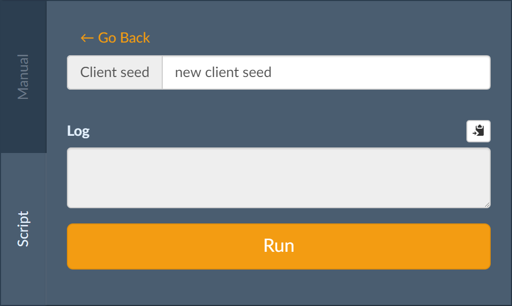

# bustadice's Script Editor API
The following fields are provided on `this`:
 - `balance`: Your last known balance
 - `bankroll`: The last known bankroll
 - `maxProfit`: The profit limit in satoshis based on the last known bankroll
 - `username`: The user name of the account running the script

These fields are only updated when you call `this.bet`.

## API Methods
All methods are provided on `this` and return a [Promise](https://developer.mozilla.org/en-US/docs/Web/JavaScript/Guide/Using_promises). Because the script is wrapped in an [async function](https://developer.mozilla.org/en-US/docs/Web/JavaScript/Reference/Statements/async_function), you may use the [await](https://developer.mozilla.org/en-US/docs/Web/JavaScript/Reference/Operators/await) operator to conveniently handle Promises.

### bet(size, target)
Places a bet and returns a Promise that resolves with the result.

`size` is the amount to bet in satoshis. Only wager sizes that are divisible by 100 (whole bits) are valid.

`target` is the target multiplier, e.g. `1.23` for 1.23x.

The result has the following form:
```js
{
  id:         string, // bet ID
  timestamp:  string, // RFC2822-compliant date string
  value:      number, // bet size in satoshi (same as size argument)
  target:     number, // target multiplier (same as target argument)
  multiplier: number, // bet outcome
  bankroll:   number, // bankroll in satoshis after the bet
  balance:    number, // user balance in satoshis after the bet
  nonce:      number  // the bet's nonce
}
```

### clearLog()
Clears the log.

### log(...arguments)
Outputs the given arguments to the log. If you want to log objects other than strings and numbers, don't forget to convert them to strings first, e.g. by using [JSON.stringify](https://developer.mozilla.org/en/docs/Web/JavaScript/Reference/Global_Objects/JSON/stringify).

### notify(message)
If you want to emit browser notifications from the script,
use `notify(message)`. This is good for sending yourself messages
about notable events (like if the script is stopping itself) when
you are viewing another browser tab or application.

Note that you must have browser notifications enabled for bustadice.com.

You may not always want a script to bother you with browser notifications.
You can toggle this behavior in the [notification settings](https://bustadice.com/play/notifications).
When script notifications are disabled, `notify()` messages will simply
appear in the script logs.

### newSeedPair(seed)
Reveals the previous seed pair and generates a new one using the given client seed. If no client seed is provided, one is generated randomly.

Calling `newSeedPair` will fail if the current seed pair is unused, i.e. if no bets have been made with it yet.

The result has the following form:
```js
{
  prev_server_seed: string, // previous server seed
  prev_client_seed: string, // previous client seed

  server_seed_hash: string  // hash of new server seed
}
```

### resetStatistics()
Resets the statistics shown beneath the multiplier.

### setClientSeed(seed)
Set the client seed. If no client seed is provided, one is generated randomly.

Calling `setClientSeed` will fail if the current seed pair has already been used, i.e. if bets have been made with it.

### skip()
Skips the next bet.

The result has the following form:
```js
{
  id:         string, // bet ID
  timestamp:  string, // RFC2822-compliant date string
  multiplier: number  // bet outcome
}
```

### stop()
Instructs the script editor to stop the script.


## Chat messages
Scripts can react to chat messages in public channels by listening on this for the `PUBLIC_CHAT_MESSAGE` event:
```js
this.on("PUBLIC_CHAT_MESSAGE", payload => this.log(`${payload.sender} said ${payload.body} in the ${payload.channel} channel.`))
```

The payload passed to the callback function has the following form:
```js
{
  id:        number, // message ID
  timestamp: string, // RFC2822-compliant date string
  channel:   string, // name of the chat channel in which the message was received
  sender:    string, // user name of the message author
  body:      string // contents of the message
}
```


## GUI Configuration
bustadice supports optional GUI configuration of scripts, allowing the player to configure the script's parameters in a user-friendly manner.

The GUI-configurable options are defined by creating a `config` variable on the first line of the script. `config` **must** be a `var` (not a `const` or `let`) and **must** be on the first line (not even preceded by comments). bustadice will parse the `config` variable into a form. When it runs the script will have access to the values provided in the form by the player.

A minimal `config` object could look like this:

```javascript
var config = {
  clientSeed: { label: "Client seed", type: "text", value: "new client seed" }
};
```

We define a configuration variable called `clientSeed`, give it the label *Client seed* and the initial value *new client seed*. This is what the resulting UI looks like:



In our script, we can then access the value the player chose:

```javascript
await this.log(config.clientSeed.value);
```

### Input types

The example `config` object above only uses a single configuration variable of type `text`, but there are several types that we can use:

#### `balance`
A field representing an amount given in bits. The input is automatically converted to satoshi before being supplied to the script.

```javascript
var config = {
  baseBet: { label: "Base bet", type: "balance", value: 100 }
};
```

#### `checkbox`
A checkbox that allows you to active a single option (or not). The value provided to the script will be `true` if the box is checked and `false` otherwise.

```javascript
var config = {
  stopOnWin: { label: "Stop on win", type: "checkbox", value: true },
};
```

#### `multiplier`
A multiplier. The value is parsed as a floating-point number before being provided to the script.

```javascript
var config = {
  target: { label: "Target multiplier", type: "multiplier", value: 2.00 }
};
```

#### `noop`
A label without a form input, useful as part of a radio field (see below) or as a header to a group of fields.

```javascript
var config = {
  basicHeader: { label: "Basic Options", type: "noop" }
};
```

#### `number`
A generic number. The value is parsed as a floating-point number before being provided to the script.

```javascript
var config = {
  target: { label: "Stop after wins", type: "number", value: 5 }
};
```

#### `radio`
A group of fields that lets you choose exactly one of several options.

```javascript
var config = {
  loss: {
    label: "On loss", type: "radio", value: "increase", options: {
      base: { label: "Return to base bet", type: "noop" },
      increase: { label: "Increase bet by", type: "multiplier", value: 2 }
    }
  }
};
```

`config.loss.value` will be a string and either `base` or `increase`. If `increase` was chosen, the multiplier's value is accessible at `config.loss.options.increase.value`.

#### `combobox`
A dropdown box that lets you choose one of several options.

```javascript
var config = {
  color: {
    type: "combobox",
    // optional: true,
    value: "red",
    label: "Favorite color",
    options: {
      red: { label: "Red" },
      yellow: { label: "Yellow" },
      blue: { label: "Blue" }
    }
  }
};

log(config.color.value);
```

If configured to `optional: true`, then a "None" option will be added and,
when selected, `config.color.value` will be `undefined`.

Otherwise, be sure to provide an initial `value` setting that points to one
of the keys in your `options` mapping.

#### `text`
A simple text field that provides a string to the script.

```javascript
var config = {
  clientSeed: { label: "Client seed", type: "text", value: "new client seed" }
};
```


## Examples
 - [Flat Bet](flat-bet.js), which places the same bet repeatedly until the target multiplier is hit
 - [Martingale](martingale.js), which follows the [Martingale system](https://en.wikipedia.org/wiki/Martingale_(betting_system))
 - [Payout Martingale](payout-martingale.js), which is similar to Martingale but increases the target multiplier
 - [Labouchère](labouchere.js), which follows the [Labouchère system](https://en.wikipedia.org/wiki/Labouch%C3%A8re_system)
 - [Random](random.js), which bets random amounts with random target multipliers.
 - [Seed](seed.js), which requests a new seed pair and then sets a new client seed
